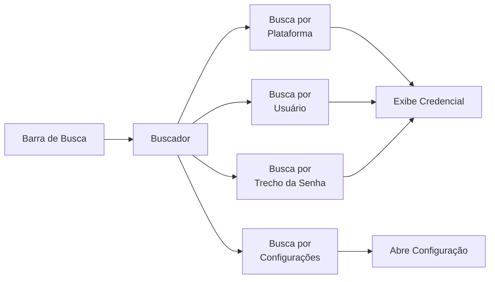
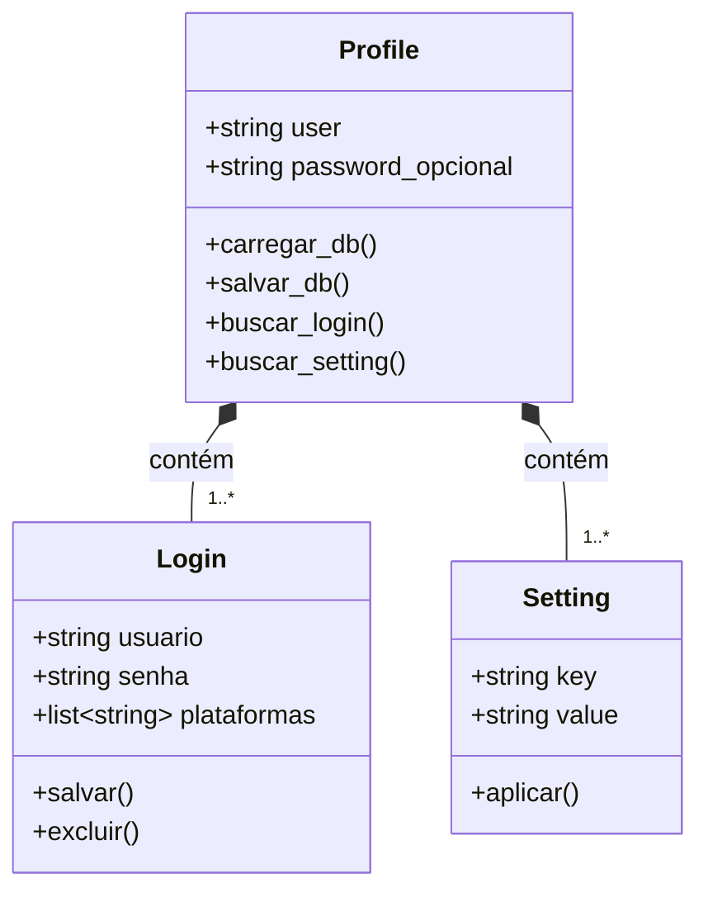

<div align="center">

  # Pyssword

  Aplicativo leve e poderoso de *Geração, Armazenamento e Gerenciamento* de senhas.

  

  [Funcionalidades](#funcionalidades) | [Instalação](#instalação) | [Nosso Workflow](#nosso-workflow)

  Ferramentas
  
  
  
  *Python • Flask • PyWebView*
  
  Detalhes:
  
  
  
  
  
  Suporte:
  
  
  

</div>

## Nosso Workflow:

### Sistema de Busca


### Classes



## Funcionalidades

<details>
  <summary><strong>Geração de Senhas</strong></summary>

   - Gerar senhas randômicas, numéricas ou mnemônicas
   - Controlar uso de caracteres especiais, números, capitalização e comprimento
   - Armazenar credenciais de usuário e senha associadas por plataforma

</details>

<details>
  <summary><strong>Busca Avançada</strong></summary>
  
  - Buscar por plataforma, usuário, trecho da senha ou perfil
  - Pesquisar configurações diretamente pela barra de busca
    
</details>

<details>
  <summary><strong>Configuração e Customização</strong></summary>
  
  - Customizar tema, cores, fontes e layout
  - Configurar comportamentos de inicialização e uso
  - Adicionar Profiles com camadas extras de segurança
  - Importar e exportar dados
    
</details>

<details>
  <summary><strong>Sistema de Perfis</strong></summary>

  - Separa credenciais de usuario e senha em profiles individuais
  - Adicionar Credenciais opcionais de acesso
  - Estabelece camadas extras de segurança e acessibilidade

</details>

## Roadmap

- [ ] Plataformas:
  - [x] Windows 10/11
  - [x] Linux (QT Web Engine)
  - [ ] Linux (GTK)
  - [ ] Android
  - [ ] Mac
- [x] Geração de Senhas:
  - [x] Numéricas
  - [x] Randomicas
  - [x] Mnemonicas
- [ ] Sistema de Busca:
  - [ ] Plataformas
  - [ ] Usuários
  - [ ] Trecho da Senha
  - [ ] Configurações
- [ ] Configurações:
  - [ ] Visualização (tema, cores, fontes)
  - [ ] Comportamentos (inicialização, atalhos)
  - [ ] Importação e exportação de dados
  - [ ] Integração com sistema de perfis
  - [ ] Idiomas
- [ ] Profiles:
  - [ ] Criar/editar/excluir
  - [ ] Isolar DB por Profile
  - [ ] Login/senha opcionais
  - [ ] Alternância entre profiles

## Stack
<div align="center">
<table>
<tr>
  <th>Back-end</th>
  <th>Flask + PyWebView</th>
</tr>
<tr>
  <th>Front-end</th>
  <th>Bootstrap + Bootstrap Icons</th>
</tr>
</table>
</div>

## Instalação
```bash
# Clone o repositório
git clone https://github.com/NycolasGarcia/Pyssword.git

# Entre na pasta
cd Pyssword-main

# Crie ambiente virtual
python -m venv venv

# Ative o ambiente

    # Windows
    venv\Scripts\activate

    # Linux
    source venv/bin/activate

# Instale dependências
pip install -r requirements.txt

# Execute o projeto

    # Windows
    py app.py

    # Linux
    python3 app.py
````

## Estrutura do Projeto
```
EDA-Speeder/
│
├── routes/
│
├── services/
│
├── static/
│   ├── css/
│   └── js/
│
├── templates/
│   ├── index.html
│   ├── common/
│   │   ├── base.html
│   │   ├── header.html
│   │   └── footer.html
│   └── modals/
│   │   ├── changelog.html
│   │   ├── password.html
│   │   ├── profile.html
│   │   ├── search.html
│   │   └── settings.html
│   │
├── app.py
├── README.md
└── requirements.txt
```

## Contato

<div align="center">

| Plataforma | Link |
|------------|------|
|  LinkedIn | <a href="https://www.linkedin.com/in/NycolasAGRGarcia/" target="_blank">Acessar</a> |
|  GitHub | <a href="https://github.com/NycolasGarcia" target="_blank">Acessar</a> |
|  Gmail | <a href="mailto:nycolasagrg@gmail.com">Enviar</a> |
|  Vercel | <a href="https://dev-nycolas-garcia.vercel.app/" target="_blank">Visitar</a> |

</div>
